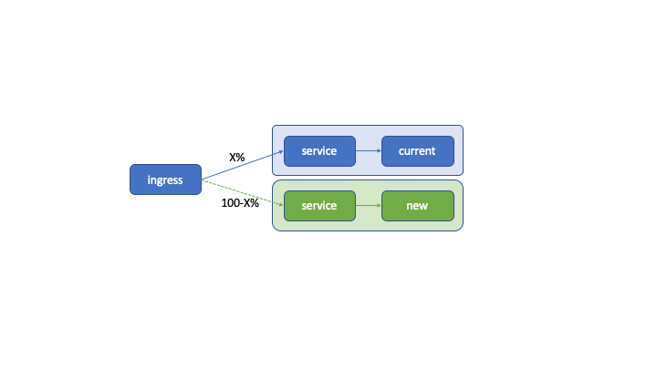

# K8S

Utilities and examples for kubernetes

## Production deployments stragies 

### Canary Releases

Canary Release is a production deployment strategy to ensure new releases are robust and stable.

Canary Release redirects a percentage of the traffic from one pod to another so that possible bugs in the new version have a very limited impact.

The traffic will increase until reaching 100% and the new version will replace the current one.

During the increment of the canary, errors will be checked, if they exist, and the % of the canary will be increased accordingly.

